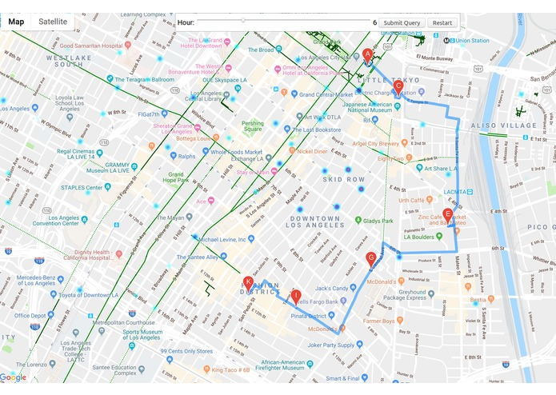

## Installation
```bash
git clone git@github.com:Fnjn/BikeRoute.git
cd BikeRoute
pip install -r requirements.txt

export FLASK_APP=server.py
flask run
```

##  Test case
TODO


## What it works
We harvested crime data from [DataLa](https://data.lacity.org/) and considered them in the path finding. Using Python and Java script we parted LA in little squares and assigned danger levels to each. Then a RRT should find the best path from the start to the goal avoiding areas with a high crime rate.



## How we built it
The first step we implemented was the recovery and cleaning of the [Crime Data-set](https://data.lacity.org/A-Safe-City/Crime-Data-from-2010-to-Present/y8tr-7khq). In the next hours we clustered LA into zones with distinct danger levels. From there on we displayed this clusters in the Google maps API. After getting comfortable with the API we wrote a class that is able to display a path based on keypoints we submitted. Additionally a RRT-pathfinding algorithm was impemented and made it run on a python server in order to communicate with the Javascript program we wrote. The RRT finds a way through LA avoiding unwanted areas and creating key points to send to our Java script programm.
